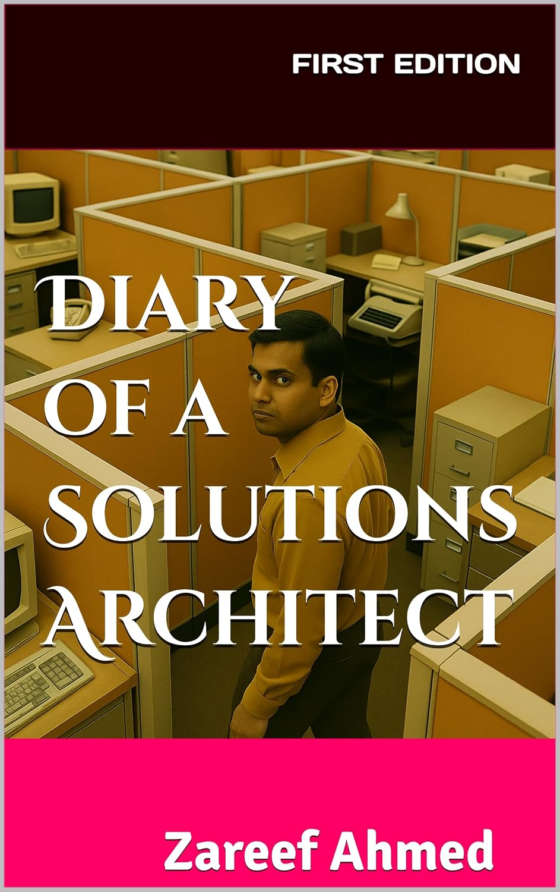

# Technical Architecture Review

This is a practical guide to technical architecture. It explains what architecture really is, the different forms it takes, why it needs to be reviewed, and why the most valuable reviews come from independent third parties who have no stake in any vendor involved in the solution.

One idea sits at the center of everything here:

> **"Solutions Architecture must be solutions architecture, not a sales agent of a specific vendor."**

An architecture exists to serve a problem and the organization that owns it. The moment it starts serving a product catalog instead, it stops being architecture and becomes a sales proposal with nice diagrams. This guide explains how that happens, what it costs, and how independent review protects you from it. The full story behind the quote is in [Not a Sales Agent](docs/04-independent-third-party-review/not-a-sales-agent.md).

## How this guide is organized

The material is split into five sections that build on each other:

### [1. Foundations](docs/01-foundations/README.md)
What technical architecture is and where it fits in a project.

- [What Is Technical Architecture?](docs/01-foundations/what-is-technical-architecture.md)
- [The Scope of Architecture in Technical Projects](docs/01-foundations/scope-of-architecture-in-projects.md)
- [The Role of the Architect](docs/01-foundations/role-of-the-architect.md)

### [2. Types of Architecture](docs/02-types-of-architecture/README.md)
The major architecture domains. Each chapter covers what the domain does, the decisions it owns, and what a reviewer looks for in it.

- [Enterprise Architecture](docs/02-types-of-architecture/enterprise-architecture.md)
- [Solution Architecture](docs/02-types-of-architecture/solution-architecture.md)
- [Software / Application Architecture](docs/02-types-of-architecture/software-application-architecture.md)
- [Data Architecture](docs/02-types-of-architecture/data-architecture.md)
- [Infrastructure & Cloud Architecture](docs/02-types-of-architecture/infrastructure-cloud-architecture.md)
- [Security Architecture](docs/02-types-of-architecture/security-architecture.md)
- [Integration Architecture](docs/02-types-of-architecture/integration-architecture.md)

### [3. Architecture Review](docs/03-architecture-review/README.md)
Why reviews matter, how they work, and what you get out of them.

- [Why Architecture Review Matters](docs/03-architecture-review/why-architecture-review-matters.md)
- [The Review Process and Lifecycle](docs/03-architecture-review/review-process-and-lifecycle.md)
- [Review Methods and Frameworks](docs/03-architecture-review/review-methods-and-frameworks.md)
- [Benefits and Outcomes](docs/03-architecture-review/benefits-and-outcomes.md)

### [4. Independent Third-Party Review](docs/04-independent-third-party-review/README.md)
The heart of this guide. Independence from vendors is not a nice extra. It is the thing that makes a review worth trusting.

- [Why Independence Matters](docs/04-independent-third-party-review/why-independence-matters.md)
- [Not a Sales Agent](docs/04-independent-third-party-review/not-a-sales-agent.md) (the centerpiece essay)
- [Conflicts of Interest and Vendor Bias](docs/04-independent-third-party-review/conflicts-of-interest-and-vendor-bias.md)
- [Engaging Independent Reviewers](docs/04-independent-third-party-review/engaging-independent-reviewers.md)

### [5. Templates and Checklists](docs/05-templates-and-checklists/README.md)
Working tools you can copy and use right away.

- [Architecture Review Checklist](docs/05-templates-and-checklists/architecture-review-checklist.md)
- [Review Report Template](docs/05-templates-and-checklists/review-report-template.md)
- [Vendor-Bias Red Flags](docs/05-templates-and-checklists/vendor-bias-red-flags.md)

## Reading paths

**If you are a sponsor, CTO, or procurement leader** and you want the case without the mechanics, read these five in order:

1. [What Is Technical Architecture?](docs/01-foundations/what-is-technical-architecture.md)
2. [Why Architecture Review Matters](docs/03-architecture-review/why-architecture-review-matters.md)
3. [Why Independence Matters](docs/04-independent-third-party-review/why-independence-matters.md)
4. [Not a Sales Agent](docs/04-independent-third-party-review/not-a-sales-agent.md)
5. [Vendor-Bias Red Flags](docs/05-templates-and-checklists/vendor-bias-red-flags.md)

**If you are an engineer or architect**, read the whole thing in order:

1. All of [Foundations](docs/01-foundations/README.md)
2. All of [Types of Architecture](docs/02-types-of-architecture/README.md)
3. All of [Architecture Review](docs/03-architecture-review/README.md)
4. All of [Independent Third-Party Review](docs/04-independent-third-party-review/README.md)
5. Then put [Templates and Checklists](docs/05-templates-and-checklists/README.md) to work on your next review.

## From the author: Diary of a Solutions Architect

The ideas in this guide come from lived experience, and that experience is the subject of my book, **[Diary of a Solutions Architect](https://www.zareef.com/books/diary-of-a-solutions-architect)**. A raw, first-person look into the world of cloud solutions.

Where this guide gives you the framework, the book shows you the pressure the framework exists to resist. It is an unfiltered diary of an experienced cloud solutions architect working inside a sales-focused organization, caught between what the customer needs, what the company wants to sell, and what personal ethics will allow. It follows the running conflict with an account manager who pushes the high-margin services, and it looks honestly at the psychology of staying consistent, the pull of ambition, and what actually makes the work satisfying.

In other words, the book lives inside the exact tension this guide is built on:

> **"Solutions Architecture must be solutions architecture, not a sales agent of a specific vendor."**

If the chapters here convinced you of the argument, the diary shows what that argument feels like from the inside, one workday at a time. And if you read the book first, this guide is the toolkit for acting on it: the [review practices](docs/03-architecture-review/README.md), the [independence principles](docs/04-independent-third-party-review/README.md), and the [checklists](docs/05-templates-and-checklists/README.md) that turn conviction into habit.

**Read the book** (Kindle Edition, 108 pages, published July 2025):

- [Book page](https://www.zareef.com/books/diary-of-a-solutions-architect) at zareef.com
- [Buy on Amazon](https://www.amazon.com/Diary-Solutions-Architect-Zareef-Ahmed-ebook/dp/B0DWFPHMS1) (Kindle)
