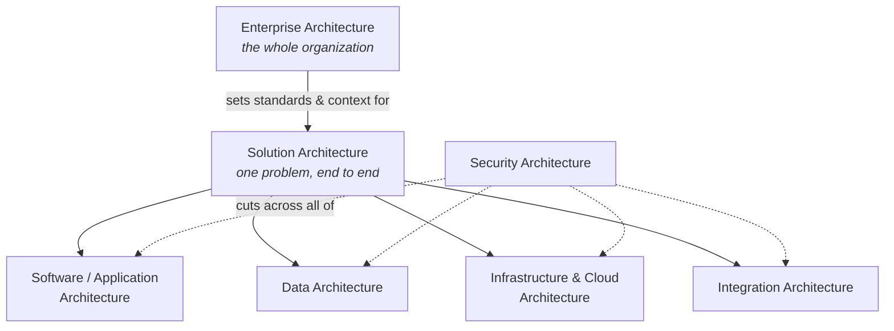

# 2. Types of Architecture

"Architecture" in a technical project is not one discipline. It is several, working at different altitudes and answering different questions. This section walks through the standard set. Every chapter follows the same shape: what the domain is, what it covers, the artifacts and decisions it owns, and what a reviewer looks for in it. Read together, the section doubles as a domain-by-domain review guide.

## How the types fit together

- **Enterprise architecture** sits at the top. It is the organization-wide view that gives individual projects their context, standards, and constraints.
- **Solution architecture** is the crucial middle layer. It takes one business problem and assembles a complete answer to it, drawing on all the specialist domains below. It is also where vendor pressure concentrates, which is exactly why the central quote of this guide is about solutions architecture in particular.
- **Software, data, infrastructure, and integration architecture** are the specialist domains a solution is built from.
- **Security architecture** cuts across all of them. It is a property of the whole, not a component you can bolt on.

## In this section

1. [Enterprise Architecture](enterprise-architecture.md)
2. [Solution Architecture](solution-architecture.md). Read this one even if you skip the rest. It sets up the vendor-neutrality theme of [Section 4](../04-independent-third-party-review/README.md).
3. [Software / Application Architecture](software-application-architecture.md)
4. [Data Architecture](data-architecture.md)
5. [Infrastructure & Cloud Architecture](infrastructure-cloud-architecture.md)
6. [Security Architecture](security-architecture.md)
7. [Integration Architecture](integration-architecture.md)

---

**Navigate:** [← Previous: Foundations](../01-foundations/README.md) · [↑ Home](../../README.md) · [Next: Architecture Review →](../03-architecture-review/README.md)
