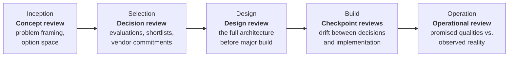

# The Review Process and Lifecycle

A review that actually changes outcomes has a defined process: a clear scope going in, structured examination in the middle, and findings that someone is accountable for acting on. This chapter walks through that process and shows where reviews fit in a project's life.

## When to review

- **Concept review** (the cheapest, and the highest leverage): is the problem framed correctly, and is the field of options honest? Or has it already been narrowed to the shape of one vendor's product?
- **Decision review**: before anything gets signed. The comparisons, cost models, and contract terms can still change, so a week of scrutiny here is worth months later. This is the single most valuable review to make independent, because it is the one vendors work hardest to influence.
- **Design review**: the classic full review of a solution architecture, done before serious build money gets spent.
- **Checkpoint reviews**: shorter sessions during delivery. Is the system being built still the system that was designed?
- **Operational review**: after go-live, or on an inherited estate. Did the architecture deliver the qualities it promised, at the cost it promised?

One project does not need all five. Match the depth to the stakes. A small internal tool might deserve one lightweight design review. A core banking replacement deserves every stage.

## What the reviewer needs

- The architecture documentation, including decision records with the rejected alternatives
- The requirements and quality attributes, with sources: who asked for each one, and why
- The option evaluations, cost models, and any vendor proposals or reference material that was used
- Access to the people: architects, engineers, operators, and the business owner
- For running systems: incident history, cost reports, performance data, and samples of the actual code and configuration
- The commercial picture: licenses, contracts, and commitments in force or on the table

A note on that last item. Teams sometimes treat contracts as out of scope for a "technical" review. They are not. Commercial terms constrain your technical future exactly the way interfaces do, and a reviewer who cannot see the contracts cannot assess lock-in.

## The process, step by step

1. **Scope and charter.** One page: what is being reviewed, against what criteria, who receives the findings, and what is out of scope. Agreed with the sponsor. Not with the team under review alone, and never with a vendor.
2. **Document study.** The reviewer reads before interviewing, and arrives with questions and hypotheses.
3. **Interviews and walkthroughs.** Structured sessions with the architects (what was intended), the engineers (what was actually built), the operators (what actually breaks), and the business owners (what was actually needed). When these four accounts diverge, that divergence is itself a primary finding.
4. **Verification.** Checking reality against the documents: code, configuration, cost data, test results. A review that never leaves the slide deck verifies nothing.
5. **Analysis and drafting.** Findings ranked by risk, each with evidence, impact, and a concrete recommendation. The [report template](../05-templates-and-checklists/review-report-template.md) gives the structure.
6. **Playback.** Findings go to the team first, where factual corrections are welcome but conclusions are not up for negotiation. Then to the sponsor.
7. **Follow-through.** Every accepted finding gets an owner and a date. A review whose findings have no owners was a presentation, not a review.

## What comes out

- **The review report**: context, scope, findings by severity, recommendations. See the [template](../05-templates-and-checklists/review-report-template.md).
- **Risk register entries**: architectural risks tracked in the project's normal mechanism.
- **Decision log updates**: wherever the review changed or confirmed a decision, recorded as such.

## Cadence and proportionality

For ongoing estates, a yearly cycle, or one driven by events like a major purchase, a redesign, or a serious incident, keeps reviews connected to real stakes. The failure modes at both extremes are well known: a review-everything bureaucracy that teams learn to route around, and a review-nothing culture that discovers its architecture in the post-incident report. The operating principle is proportionality. Match the depth of review to the cost of being wrong.

---

**Related topics**

- [Review Methods and Frameworks](review-methods-and-frameworks.md)
- [Engaging Independent Reviewers](../04-independent-third-party-review/engaging-independent-reviewers.md)
- [Architecture Review Checklist](../05-templates-and-checklists/architecture-review-checklist.md)

**Navigate:** [← Section index](README.md) · [↑ Home](../../README.md)
